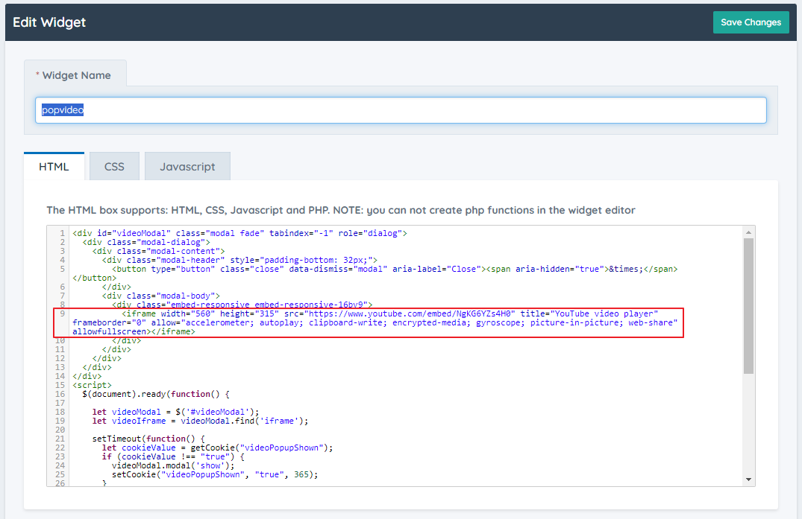
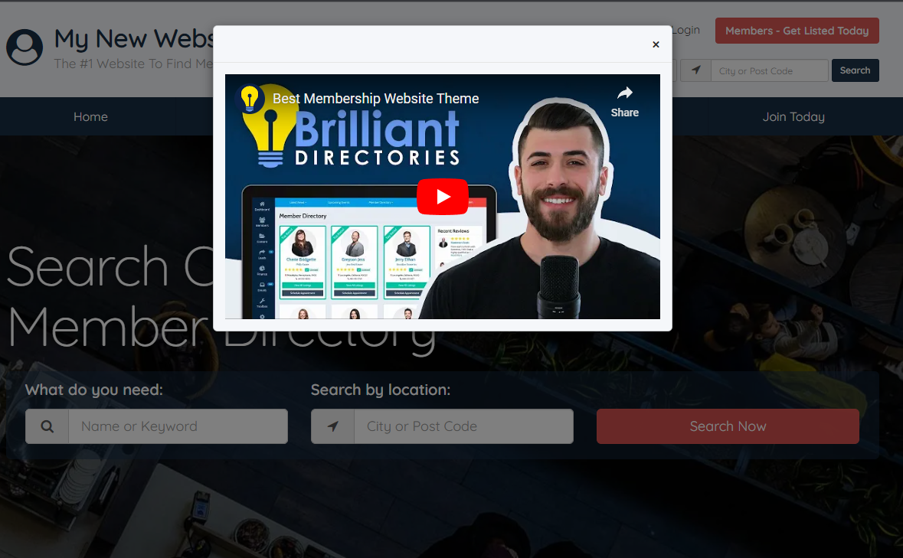
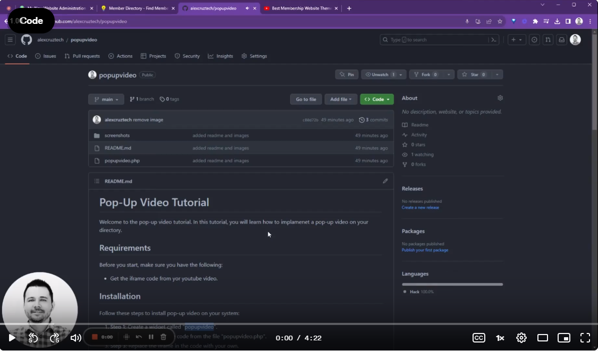

# Pop-Up Video Tutorial

Welcome to the pop-up video tutorial. In this tutorial, you will learn how to implamenet a pop-up video on your directory.

## Requirements

Before you start, make sure you have the following:

- Get the iframe code from yor youtube video.

## Installation

Follow these steps to install pop-up video on your system:

1. **Step 1:** Create a widget called "popupvideo".
2. **Step 2:** Copy and paste the code from the file "popupvideo.php".
3. **Step 3:** Replace the iframe in the code with your own.

4. **Step 4:** Save the widget.
5. **Step 5:** Add the widget in Design Settings > Custom CSS / HEAD > Additional Footer Code: <?php echo widget("popupvideo"); ?>

## Usage

Here's how to test the pop-up video:

1. **Step 1:** Visit your website, and within five seconds, the video will appear.
2. **Step 2:** When you close the pop-up, the video will stop playing, and we will save a cookie to prevent the video from showing again to the same visitor.

**Note:** If it's the first time visiting the page, the pop-up video will show regardless of which page you visit on the site. If you only want the pop-up video to appear on specific pages, you need to call the video on those pages.

## Screenshots

Below is a screenshot that show how pop-up video looks in action:

## Video Implementation

Watch a video demonstration of the pop-up feature:

## Contributions

If you encounter any issues or have an idea to improve pop video, feel free to contribute!

1. Step 1: Fork this repository.
2. Step 2: Create a new branch for your changes.
3. Step 3: Make your changes and create a pull request.

---

We hope this tutorial has helped you understand how to use it.

If you have any questions or issues, don't hesitate to open an issue in this repository.
